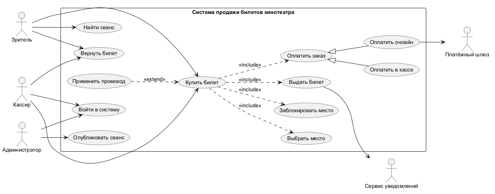
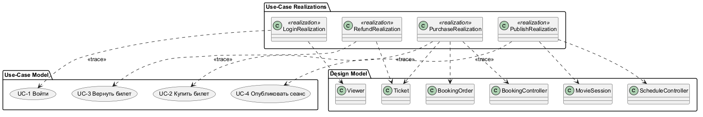
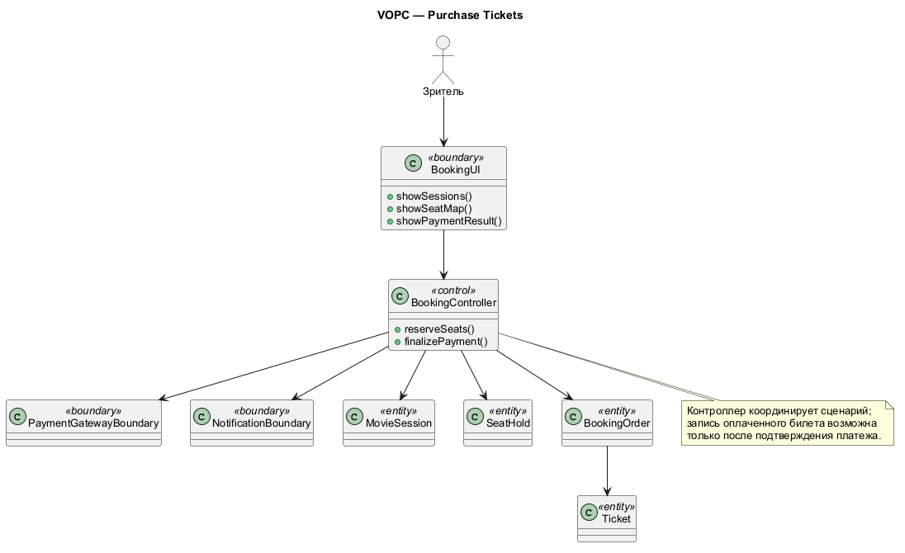
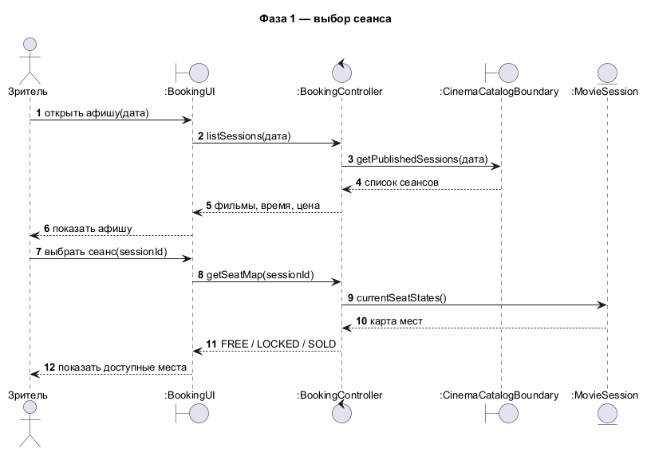
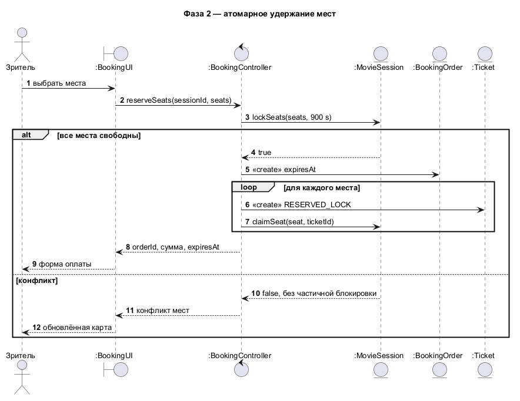
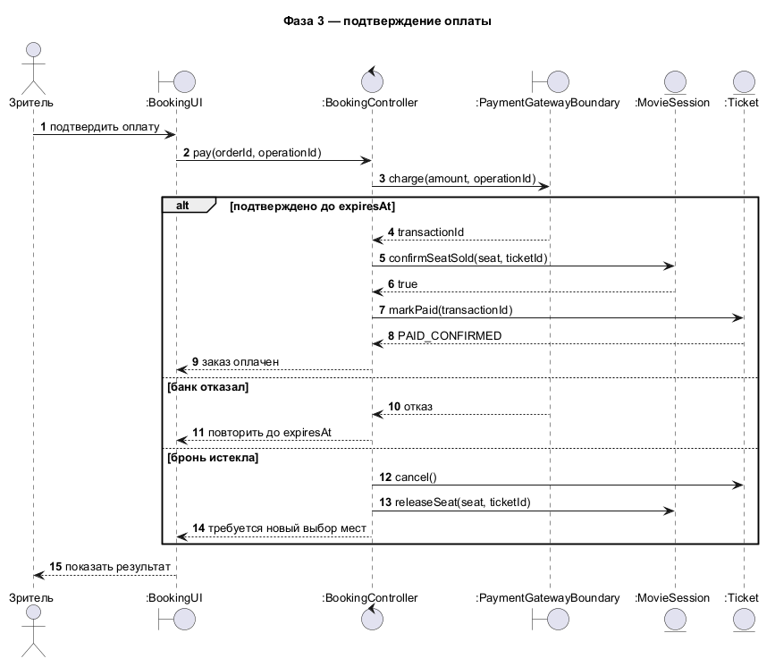
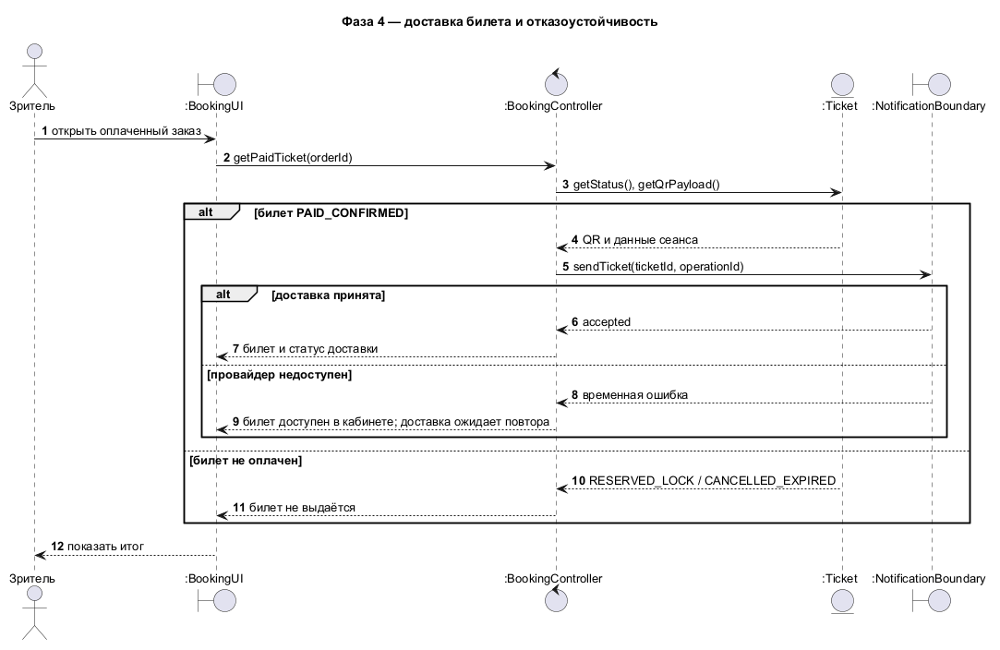
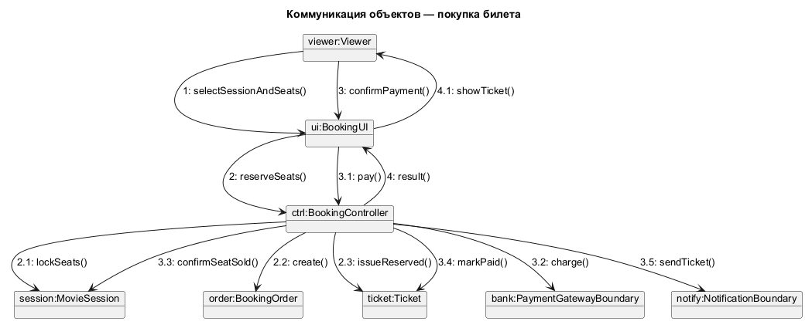
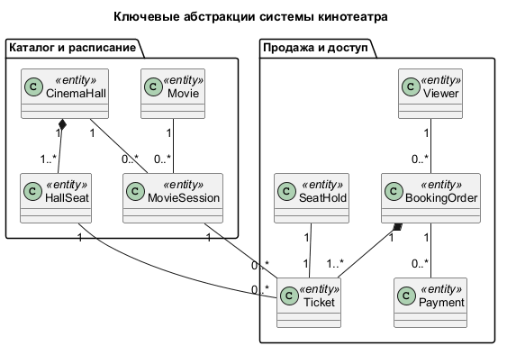

{{json
{
  "discipline": "Программная инженерия",
  "title": "Лабораторная работа № 2. Анализ требований и сценариев кинотеатра",
  "student": {"name": "Смирнов Никита Михайлович", "course": "3", "group": "ФИТ-242", "program": "02.03.02 Фундаментальная информатика и информационные технологии"},
  "teacher": {"title": "ассистент", "name": "Плескунов Д. А."},
  "institution": {"short": "ОмГТУ", "department": "ПМиФИ", "year": "2026"},
  "work": {"type": "Лабораторная работа"}
}
}}

# АННОТАЦИЯ

Отчёт описывает требования и поведение системы продажи билетов кинотеатра. Девять воспроизводимых диаграмм охватывают прецеденты, трассировку, классы анализа и сообщения основного сценария.

# СОДЕРЖАНИЕ

# ВВЕДЕНИЕ

Цель работы — применить метод анализа требований из главы 3 пособия [1] к системе кинотеатра, выбранной для сквозного проекта. Задание `materials/tasks/lab_2.txt` буквально отсылает к примеру регистрации студентов; предметная область этого отчёта изменена по указанию заказчика. Следовательно, методические типы моделей и последовательность анализа сохранены, но исходный учебный домен заменён. Нативный проект CASE-среды в репозитории отсутствует; модели представлены редактируемым PlantUML.

# ОСНОВНАЯ ЧАСТЬ

## 1 Предметная область и требования

Зритель выбирает фильм, сеанс и места, получает временное удержание, оплачивает заказ и получает билет. Кассир выполняет тот же коммерческий сценарий через кассовый интерфейс. Администратор публикует расписание, внешний платёжный шлюз подтверждает платежи, сервис уведомлений доставляет информацию. Для одного сеанса место может иметь не более одного активного оплаченного билета; отображённая карта мест не резервирует место.

Таблица: Функциональные и качественные требования

| ID | Требование | Способ отражения |
|---|---|---|
| FR-01 | Просмотр опубликованных фильмов и сеансов | Прецеденты, фаза 1 |
| FR-02 | Выбор и атомарное удержание мест на ограниченное время | Фаза 2, SeatHold |
| FR-03 | Подтверждение оплаты без повторной выдачи билета | Фаза 3, идемпотентный ключ |
| FR-04 | Получение билета и повторная доставка уведомления | Фаза 4 |
| FR-05 | Возврат оплаченного неиспользованного билета | Прецедент возврата, состояние Ticket |
| QR-01 | Защита от двойной продажи одного места на сеанс | Уникальность пары сеанс/место, атомарная фиксация |
| QR-02 | Отказ внешней доставки не отменяет оплату | Разделение билета и уведомления |

## 2 Сценарий Purchase Tickets

**Предусловия:** выбран опубликованный сеанс; продажа открыта. **Основной результат:** оплаченный заказ содержит билеты на выбранные места; зритель видит идентификатор заказа. **Основной поток:** просмотр афиши; выбор сеанса; выбор мест; атомарное удержание; создание заказа; отправка платежа; подтверждение по уникальному ключу; выдача билетов; доставка уведомления. **Альтернативы:** занятое место — повторный выбор; отказ платежа или истечение удержания — освобождение мест; повторный callback — возврат существующего результата; сбой уведомления — повторная доставка без повторного платежа.

Спецификации `Login`, `Purchase Tickets` и `Publish Session` находятся в `specifications/`; они отделяют требования к участникам от поведения объектов.

## 3 Диаграммы и решения

### 3.1 Диаграмма вариантов использования

**Инженерное обоснование.** Граница системы охватывает продажу и управление сеансами. Зритель и кассир имеют общую цель покупки, но используют разные каналы; администратор публикует сеансы. Платёжный шлюз и сервис уведомлений показаны внешними акторами, поскольку их состояния нельзя контролировать внутри кинотеатра. <<include>> означает обязательную проверку доступности мест, <<extend>> — условное выполнение возврата. Обобщение акторов исключает дублирование сценария продажи.

### 3.2 Трассировка прецедентов

**Инженерное обоснование.** Каждый существенный прецедент связан с реализацией и конкретными классами проектной модели. Эта связь нужна для проверки покрытия: изменение шага Purchase Tickets требует пересмотра BookingController и Ticket, а изменение публикации сеанса — MovieSession. Трассировка не заменяет исполняемые тесты, но показывает, какие артефакты должны меняться совместно.

### 3.3 Классы анализа VOPC

**Инженерное обоснование.** Граничный BookingUI принимает действия пользователя, BookingController координирует сценарий, а MovieSession, SeatHold, BookingOrder и Ticket хранят предметные состояния. Граничные классы изолируют платёж и уведомления. Такое разделение предотвращает размещение правил доступности места в интерфейсе или внешнем шлюзе.

### 3.4 Последовательность: выбор сеанса

**Инженерное обоснование.** Первая фаза запрашивает афишу, доступные сеансы и карту мест. Чтение доступности возвращает состояние на момент запроса, поэтому отображение свободного места не гарантирует будущую продажу. Окончательное решение переносится в атомарный шаг удержания.

### 3.5 Последовательность: удержание мест

**Инженерное обоснование.** Во второй фазе контроллер пытается удержать выбранные места и создаёт заказ. Одна операция должна проверить отсутствие активной блокировки или проданного билета и зафиксировать блокировку с TTL; при конфликте система возвращает занятость без частичного заказа. В распределённой реализации это требует транзакции или атомарной команды хранилища.

### 3.6 Последовательность: оплата

**Инженерное обоснование.** Оплата вынесена во внешний шлюз. Ответ подтверждается по ключу идемпотентности, после чего билеты переходят в оплаченные; отказ и истечение удержания освобождают места. Повторный callback не должен выпускать второй билет. В модели явно разделены событие оплаты и внутренняя фиксация заказа.

### 3.7 Последовательность: доставка

**Инженерное обоснование.** Доставка билета и уведомление происходят после подтверждения оплаты. Сбой отправки не отменяет оплаченную покупку: сообщение ставится на повтор с тем же идентификатором билета. Так пользователь может получить билет из личного кабинета, даже если внешний канал уведомления недоступен.

### 3.8 Диаграмма коммуникации

**Инженерное обоснование.** Нумерованные сообщения показывают тот же основной сценарий покупки, что и четыре диаграммы последовательности. Разница представления полезна для контроля связности объектов: BookingUI не обращается напрямую к базе или шлюзу, а все изменения заказа идут через контроллер.

### 3.9 Ключевые абстракции

**Инженерное обоснование.** Movie описывает произведение, MovieSession — конкретный показ, CinemaHall и HallSeat — физическое место, SeatHold — временное право выбора, BookingOrder — коммерческую операцию, Ticket — право прохода. Различие сеанса и фильма исключает продажу места без времени показа; различие удержания и билета исключает выдачу права прохода до оплаты.

# ЗАКЛЮЧЕНИЕ

Получена связанная модель из девяти диаграмм: прецеденты трассируются к классам анализа, четыре фазы последовательности и коммуникационная диаграмма описывают одну покупку. Для практической реализации необходимы транзакционное удержание мест, идемпотентность платежей и очередь повторной доставки.

# СПИСОК ИСПОЛЬЗОВАННЫХ ИСТОЧНИКОВ

1. Учебное пособие по UML, `materials/UML.pdf`, глава 3.
2. Задание ЛР 2, `materials/tasks/lab_2.txt`.
3. Исходники моделей ЛР 2, `lab_2/diagrams/*.puml`.
