{{json
{
  "discipline": "Программная инженерия",
  "title": "Лабораторная работа № 3. Классы и архитектура системы кинотеатра",
  "student": {"name": "Смирнов Никита Михайлович", "course": "3", "group": "ФИТ-242", "program": "02.03.02 Фундаментальная информатика и информационные технологии"},
  "teacher": {"title": "ассистент", "name": "Плескунов Д. А."},
  "institution": {"short": "ОмГТУ", "department": "ПМиФИ", "year": "2026"},
  "work": {"type": "Лабораторная работа"}
}
}}

# АННОТАЦИЯ

Лабораторная работа развивает требования ЛР 2 до классов проектирования, интерфейсов подсистем и физического размещения. Одиннадцать диаграмм PlantUML связывают операции, атрибуты, наследование, класс-ассоциацию, слои и взаимодействия каталога.

# СОДЕРЖАНИЕ

# ВВЕДЕНИЕ

Цель — уточнить предметную модель покупки билетов и распределить обязанности компонентов. Упражнения главы 3 пособия [1] применяются к кинотеатру по указанию заказчика, хотя `materials/tasks/lab_3.txt` ссылается на учебный пример регистрации студентов. Поэтому соблюдается состав приёмов моделирования, а буквальное соответствие исходной предметной области не заявляется. Нативный CASE-проект отсутствует; редактируемые исходники всех схем находятся в `diagrams/`.

# ОСНОВНАЯ ЧАСТЬ

## 1 Переход от анализа к проектированию

Исходными являются сценарии ЛР 2: каталог фильмов и сеансов, удержание мест, заказ, оплата, билет и возврат. Граница UI принимает ввод; контроллеры координируют действия; сущности хранят инварианты; интеграционные boundary-классы общаются с внешними системами. Сеанс — конкретный показ фильма в зале, а билет — право прохода на конкретное место и сеанс.

Таблица: Распределение ответственности

| Объект | Ответственность | Инвариант |
|---|---|---|
| MovieSession | Время, фильм и зал показа | Сеанс относится к одному залу |
| HallSeat | Физическое место | Пара ряд/место уникальна в зале |
| SeatAvailability | Состояние места в конкретном сеансе | Одна активная блокировка или продажа |
| BookingOrder | Коммерческий набор выбранных билетов | Оплата относится к одному заказу |
| Ticket | Право прохода и жизненный цикл | Использованный билет не возвращается |
| ICinemaCatalog | Чтение афиши | Клиент продажи не меняет каталог |

## 2 Диаграммы и инженерные решения

### 2.1 Операции классов анализа

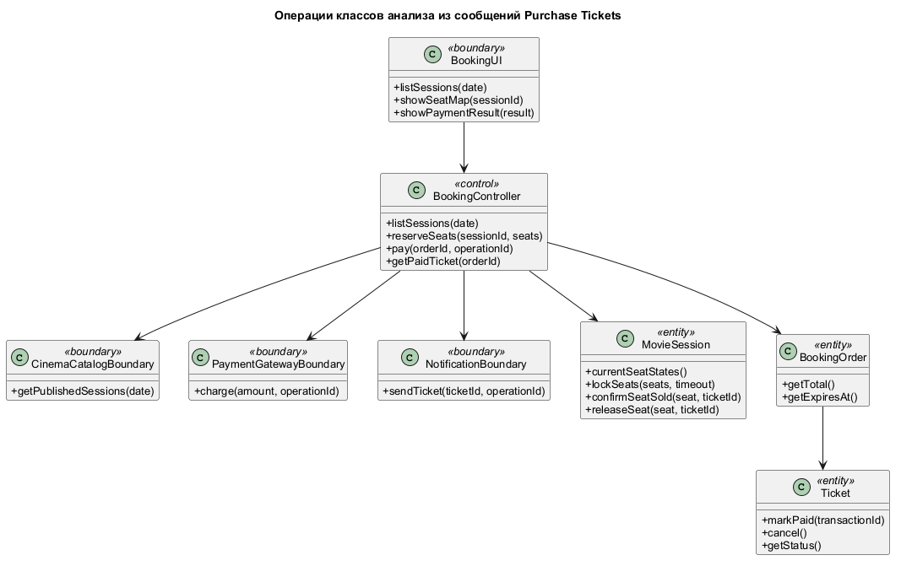

**Инженерное обоснование.** Операции выведены из сообщений сценария ЛР 2: запрос афиши, выбор мест, удержание, подтверждение оплаты и выпуск билета. Контроллер координирует транзакцию, а предметные классы содержат правила собственного состояния. Это делает сообщения диаграмм взаимодействия проверяемыми относительно API классов.

### 2.2 Атрибуты и операции

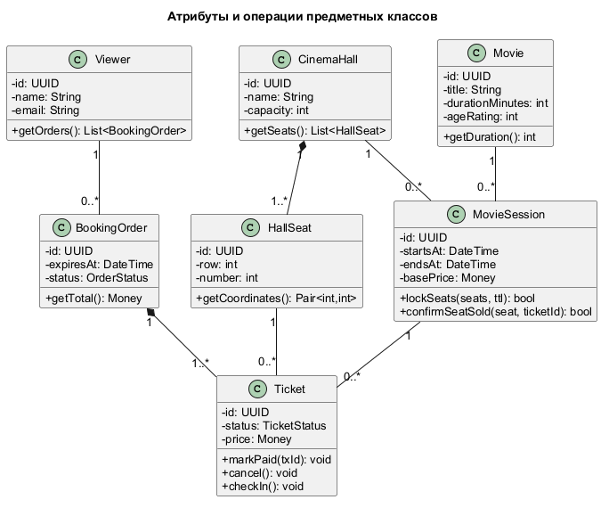

**Инженерное обоснование.** В модели различаются идентификаторы фильма, зала, сеанса, заказа и билета; цена относится к конкретному билету, а время — к сеансу. Координаты места хранятся в HallSeat. Кратности и типы операций дают основу для последующей реляционной схемы и UML-контракта.

### 2.3 Специализация сущностей

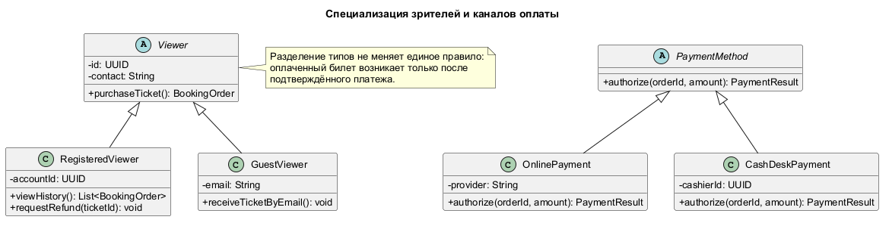

**Инженерное обоснование.** RegisteredViewer и GuestViewer имеют общую роль зрителя, но различаются сохранением профиля и способом связи. OnlinePayment и CashDeskPayment являются разными каналами подтверждения платежа. Наследование применяется только там, где подтипы сохраняют общий контракт; отдельный класс для каждого экрана не требуется.

### 2.4 Класс-ассоциация доступности

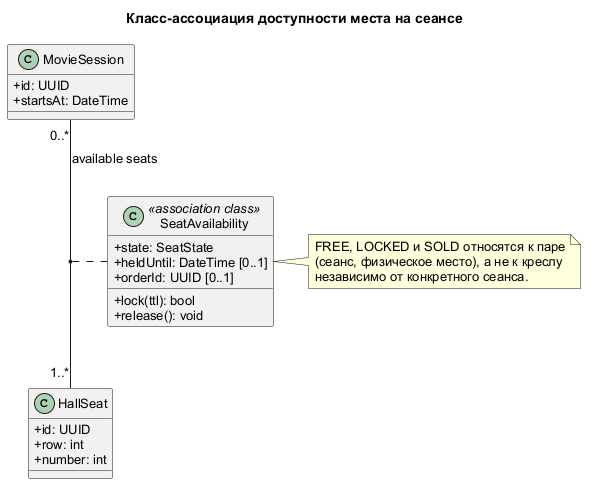

**Инженерное обоснование.** Доступность определяется парой MovieSession и HallSeat, а не одним местом: кресло может быть продано на вечерний сеанс и свободно на дневной. Класс-ассоциация SeatAvailability хранит состояние и блокировку именно для этой пары. На уровне БД паре нужен уникальный ключ; одновременные изменения сериализуются.

### 2.5 Полная VOPC-модель

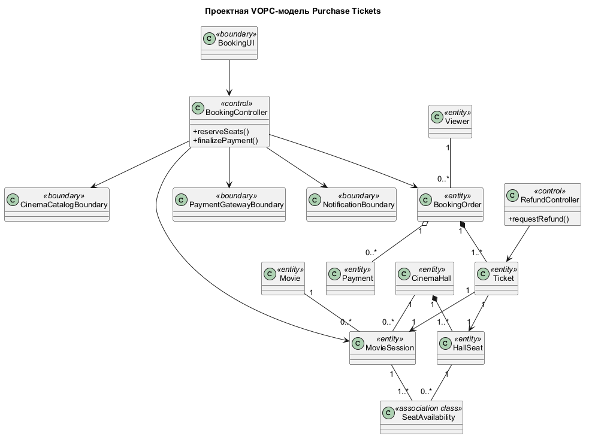

**Инженерное обоснование.** Диаграмма связывает граничные классы, контроллеры, сущности и внешние boundary-классы. Её назначение — проверить, что сценарии покупки и возврата опираются на одну предметную модель. RefundController изменяет оплаченный билет через правило возврата, не создавая вторую сущность продажи.

### 2.6 Логические слои

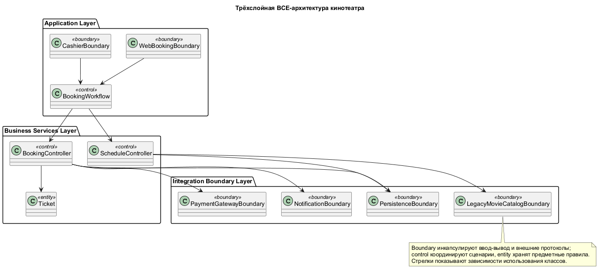

**Инженерное обоснование.** Application Layer содержит интерфейс и координацию сценариев; Business Services Layer — правила сеанса, заказа и билета; Integration Boundary Layer — граничные классы доступа к БД и внешним шлюзам. Стрелки обозначают использование: контроллер вызывает boundary, а сущность Ticket хранит предметные правила. Это BCE-модель ответственности; сетевые протоколы показаны на deployment-схеме.

### 2.7 Зависимости подсистем

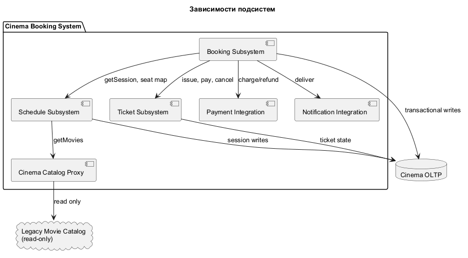

**Инженерное обоснование.** Продажа использует каталог, управление местами, платежи и уведомления через явные контракты. Разбиение помогает локализовать сбой: недоступность сервиса уведомлений задерживает доставку, но не меняет оплаченный билет; сбой хранилища мест блокирует новую продажу.

### 2.8 Интерфейс каталога

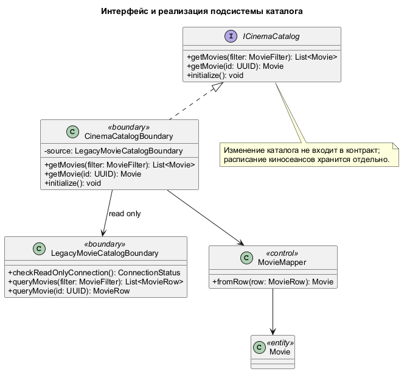

**Инженерное обоснование.** ICinemaCatalog предоставляет чтение фильмов через getMovies и getMovie. CinemaCatalogBoundary реализует интерфейс, LegacyMovieCatalogBoundary инкапсулирует внешнее хранилище, MovieMapper преобразует строки в Movie. Расписание сеансов хранится в собственной системе. Запись не входит в контракт чтения, поэтому клиент продажи не может случайно публиковать сеансы через интеграцию.

### 2.9 Чтение каталога: последовательность

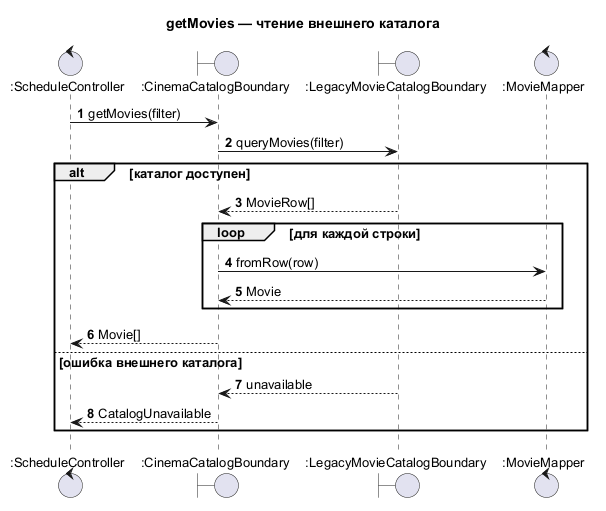

**Инженерное обоснование.** Запрос проходит через ICinemaCatalog, CinemaCatalogBoundary и LegacyMovieCatalogBoundary, после чего mapper превращает строки в предметные объекты. Изоляция формата хранения позволяет поменять таблицы или источник данных без изменения сценария продажи. Пустой результат и недоступность источника различаются.

### 2.10 Инициализация каталога: последовательность

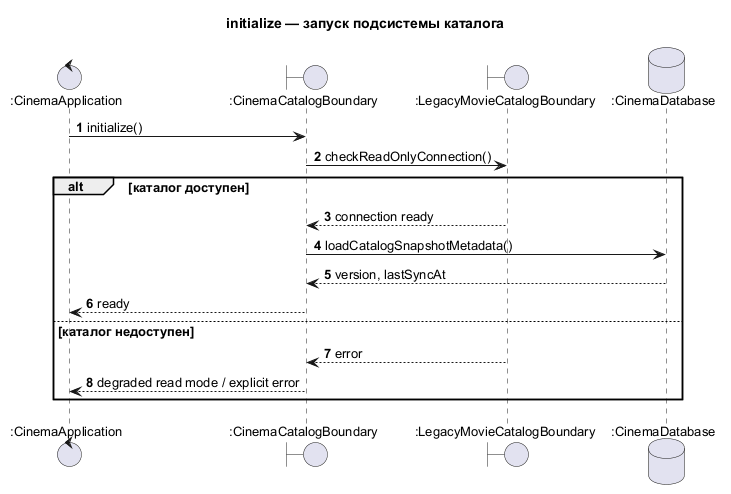

**Инженерное обоснование.** При старте CinemaCatalogBoundary проверяет доступность источника и готовит чтение данных. Инициализация не создаёт билеты и не изменяет афишу. Явный сценарий запуска позволяет зафиксировать границу отказа до приёма заказов.

### 2.11 Развёртывание

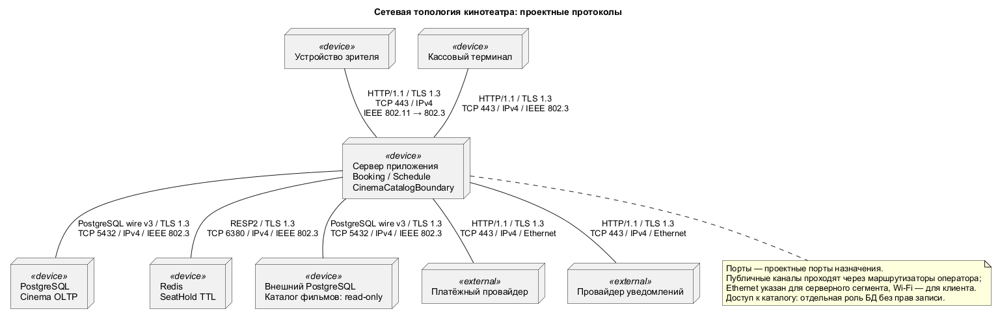

**Инженерное обоснование.** Браузер и касса обращаются к одному приложению; данные сеансов и заказов размещены в СУБД, временные блокировки мест — в хранилище с TTL, платежи и уведомления — во внешних системах. Разделение постоянного и временного состояния важно для восстановления после отказа: проданный билет нельзя восстанавливать только из кеша.

### 2.12 Соглашения сетевой модели

Клиенты и внешние провайдеры используют HTTP/1.1 поверх TLS 1.3, TCP с портом назначения 443 и IPv4. Основная БД и внешний read-only каталог используют PostgreSQL wire v3 / TLS 1.3 / TCP 5432 / IPv4. Redis использует RESP2 / TLS 1.3 / TCP 6380 / IPv4. Серверный канальный уровень — IEEE 802.3; зритель может использовать IEEE 802.11 до точки доступа. Порты и версии являются проектными настройками; протоколы операторской сети за пределами серверного сегмента не предполагаются. Идемпотентность платежа и атомарность записи являются правилами обработки, а не протоколами.

Boundary-классы обозначают границу системы: UI, платёжный шлюз, уведомления, каталог и доступ к данным. Control-классы координируют сценарии, entity-классы содержат предметное состояние. LegacyMovieCatalogBoundary объявляет checkReadOnlyConnection, используемую в диаграмме инициализации.

## 3 Согласование подсистем

`ICinemaCatalog` возвращает фильмы для чтения; расписание сеансов предоставляет отдельная подсистема. Покупка обращается к менеджеру мест и платёжному boundary-классу через границы подсистем; постоянное состояние билетов хранится в БД. Внешние вызовы не входят в транзакцию БД напрямую: для оплаты используется идемпотентный ключ, для уведомления — повторяемое событие. Полная серверная реализация в рамках данной ЛР не создаётся.

# ЗАКЛЮЧЕНИЕ

Операции и атрибуты выведены из сценария ЛР 2; класс-ассоциация фиксирует состояние места для пары «сеанс — кресло», а слои и интерфейсы показывают границы изменений. Диаграмма развёртывания связывает логическую модель с инфраструктурой, не подменяя проектирование готовым сетевым кодом.

# СПИСОК ИСПОЛЬЗОВАННЫХ ИСТОЧНИКОВ

1. Учебное пособие по UML, `materials/UML.pdf`, глава 3.
2. Задание ЛР 3, `materials/tasks/lab_3.txt`.
3. Отчёт и исходники ЛР 2, `lab_2/REPORT_LAB_2.md`, `lab_2/diagrams/`.
