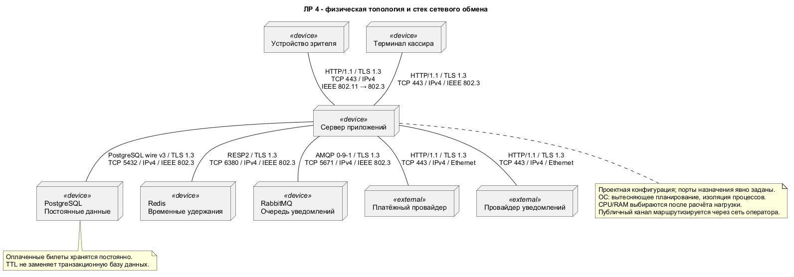
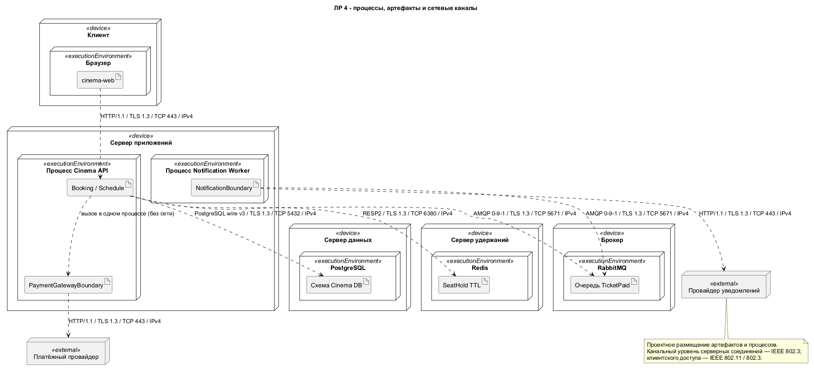
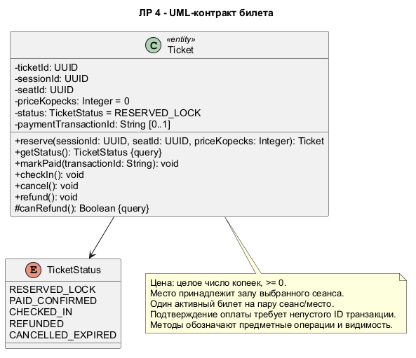
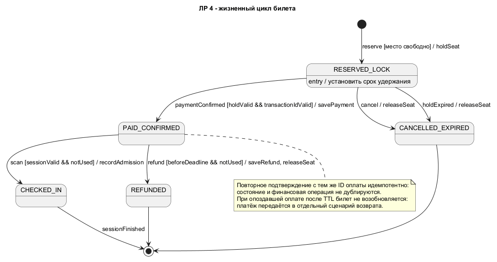
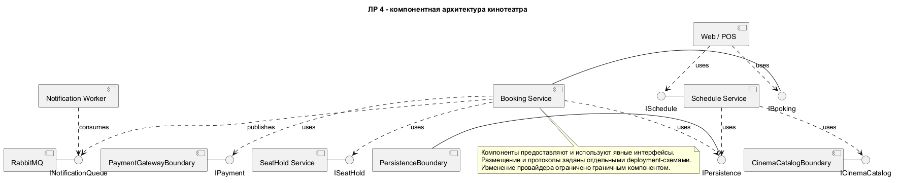
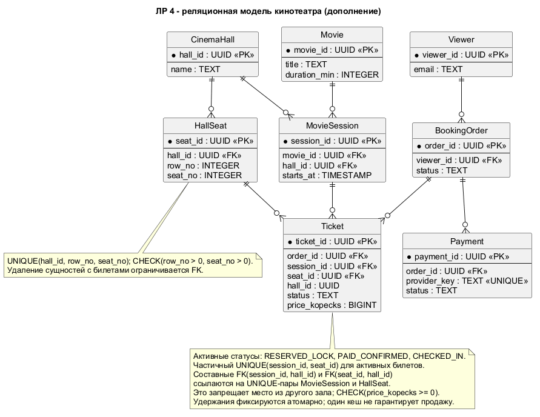

{{json
{
  "discipline": "Программная инженерия",
  "title": "Лабораторная работа № 4. Развёртывание и UML-модели кинотеатра",
  "student": {"name": "Смирнов Никита Михайлович", "course": "3", "group": "ФИТ-242", "program": "02.03.02 Фундаментальная информатика и информационные технологии"},
  "teacher": {"title": "ассистент", "name": "Плескунов Д. А."},
  "institution": {"short": "ОмГТУ", "department": "ПМиФИ", "year": "2026"},
  "work": {"type": "Лабораторная работа"}
}
}}

# АННОТАЦИЯ

Работа содержит шесть воспроизводимых UML-моделей кинотеатра: физическую топологию, размещение процессов, контракт билета, его состояния, компонентную архитектуру и реляционную схему. Для каждой модели приведены назначение и инженерные решения. Исходники PlantUML и изображения соответствуют друг другу.

# СОДЕРЖАНИЕ

# ВВЕДЕНИЕ

Цель — связать требования покупки билетов с инфраструктурой, интерфейсами и ограничениями данных. Основание — задание ЛР 4 [2] и упражнения главы 3 пособия [1]. Университетский пример адаптирован под кинотеатр по указанию заказчика. Согласованный объём этой версии — диаграммы и их пояснения; серверная конфигурация является проектом, а не результатом развёртывания. Нативный CASE-проект не представлен.

# ОСНОВНАЯ ЧАСТЬ

## 1 Состав моделей и сетевые соглашения

Таблица: Назначение моделей

| Модель | Проверяемое решение |
|---|---|
| Физическая топология | Узлы, коммуникационные пути и стек протоколов |
| Процессы и артефакты | Размещение API, worker, СУБД, Redis и брокера |
| Контракт Ticket | Типы, видимость, операции и ограничения |
| Автомат Ticket | События, guards, действия и терминальные состояния |
| Компоненты | Предоставляемые и используемые интерфейсы |
| Реляционная схема | Ключи, кратности и ограничения целостности |

Таблица: Проектные стеки обмена и порты назначения

| Канал | Прикладной протокол | Защита и транспорт | Сеть и канал |
|---|---|---|---|
| Web/POS — API | HTTP/1.1 | TLS 1.3, TCP 443 | IPv4; IEEE 802.11 для Wi-Fi клиента, IEEE 802.3 для серверного сегмента |
| API — PostgreSQL | PostgreSQL wire v3 | TLS 1.3, TCP 5432 | IPv4, IEEE 802.3 |
| API — Redis | RESP2 | TLS 1.3, TCP 6380 | IPv4, IEEE 802.3 |
| API/worker — RabbitMQ | AMQP 0-9-1 | TLS 1.3, TCP 5671 | IPv4, IEEE 802.3 |
| Внешние провайдеры | HTTP/1.1 | TLS 1.3, TCP 443 | IPv4; Ethernet в серверном сегменте |

Порты являются проектными настройками назначения, а не утверждением о работающем стенде. Интернет-каналы проходят через маршрутизаторы оператора; канальный протокол всей сети оператора не предполагается. Вызов между компонентами одного процесса не является сетевым соединением. Атомарность, транзакции и идемпотентность описывают правила обработки, а протоколы — передачу данных.

## 2 Диаграммы и инженерные решения

### 2.1 Физическая топология

**Инженерное обоснование.** Постоянные записи билетов отделены от временных удержаний Redis: истечение TTL не удаляет оплаченный билет. Брокер отделяет доставку уведомления от транзакции покупки. На коммуникационных путях указаны прикладной протокол, TLS, TCP с портом назначения, IPv4 и канальный стандарт. Вытесняющее планирование и изоляция процессов задаются как требования к ОС; CPU и RAM выбираются после оценки нагрузки. Недоступность БД останавливает запись, а недоступность уведомлений допускает повторную доставку.

### 2.2 Размещение процессов и артефактов

**Инженерное обоснование.** Физические устройства содержат executionEnvironment, внутри которых размещены артефакты. API и платёжная граница находятся в одном процессе; worker выполняется независимо и получает событие через RabbitMQ. Публикация TicketPaid должна производиться после устойчивой фиксации покупки; для согласования БД и брокера предусматривается transactional outbox и повторная публикация с идентификатором события. Consumer дедуплицирует событие. Протоколы коммуникационных зависимостей совпадают с физической топологией.

### 2.3 Контракт билета

**Инженерное обоснование.** Ticket содержит идентификаторы сеанса и места, цену в целых копейках и статус. UML-типы не привязаны к языку реализации. Закрытые атрибуты препятствуют произвольной смене состояния; публичные операции выражают допустимые действия, защищённая canRefund — проверку правила возврата. UUID не зависит от счётчика одного процесса. Запись идентификатора платежа позволяет проверять повторное подтверждение. Ограничение одной активной продажи обеспечивается постоянным хранилищем, а не только объектом в памяти.

### 2.4 Жизненный цикл билета

**Инженерное обоснование.** Начальное удержание заканчивается подтверждением оплаты, отменой или истечением срока. Переходы подписаны в форме событие [условие] / действие; entry задаёт действие входа. После прохода возврат отсутствует. Повторная доставка уже обработанного платежа не создаёт новый билет. Оплата, поступившая после освобождения места, требует отдельного финансового возврата, а не восстановления удержания. Терминальные состояния явно завершают сценарий.

### 2.5 Компонентная архитектура

**Инженерное обоснование.** Web/POS использует IBooking и ISchedule; сервис покупки использует отдельные контракты удержания, оплаты и хранения. Внешние форматы скрыты граничными компонентами. Отдельный интерфейс очереди фиксирует асинхронную связь с worker. Сплошная связь с интерфейсом означает предоставление, пунктирная зависимость — использование. Это отделяет логические обязанности от физических машин и позволяет сопоставить каждый компонент с deployment-схемой.

### 2.6 Реляционная модель

**Инженерное обоснование.** Составные внешние ключи Ticket на пары сеанс/зал и место/зал исключают продажу места чужого зала. Пара зал/ряд/место уникальна. Частичный уникальный индекс по сеансу и месту для активных статусов исключает двойную продажу, включая гонку между клиентами. Цена хранится в копейках; отрицательные значения запрещены. Ограничительное удаление сохраняет финансовую историю; отмена и возврат меняют состояние записи. Схема задаёт проектные ограничения PostgreSQL, а не утверждает, что база уже развёрнута.

## 3 Согласование моделей

Имена компонентов и протоколы deployment-моделей согласованы. Контракт и автомат используют один набор статусов. Состояния REFUNDED и CANCELLED_EXPIRED освобождают место; PAID_CONFIRMED и CHECKED_IN сохраняют активную продажу. Постоянные ограничения защищают от конкурентных изменений; Redis ускоряет временное удержание. Все изображения воспроизводятся из соседних исходников PlantUML.

# ЗАКЛЮЧЕНИЕ

Модели связывают инфраструктуру, интерфейсы, жизненный цикл и данные кинотеатра. Сетевые пути содержат конкретный стек обмена, а ограничения предметной области отражены в контракте, автомате и ERD. Объём практической части этой версии ограничен диаграммами по указанию заказчика.

# СПИСОК ИСПОЛЬЗОВАННЫХ ИСТОЧНИКОВ

1. Учебное пособие по UML. materials/UML.pdf. Глава 3.
2. Задание ЛР 4. materials/tasks/lab_4.txt.
3. Требования и архитектура кинотеатра. lab_2/REPORT_LAB_2.md; lab_3/REPORT_LAB_3.md.
