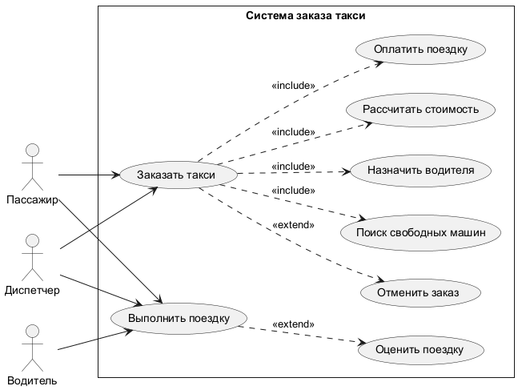
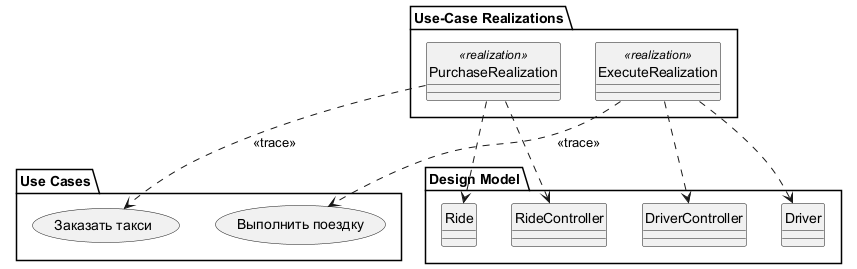
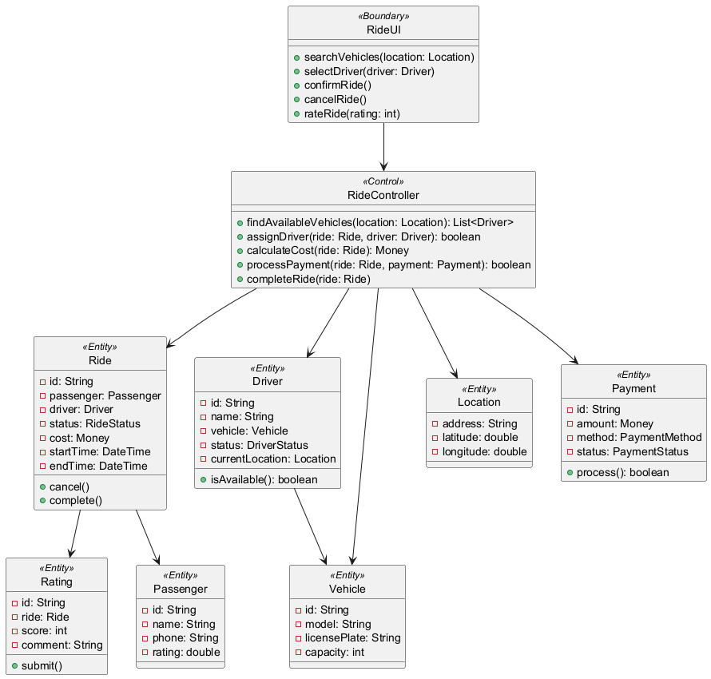
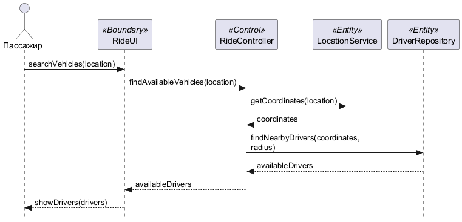
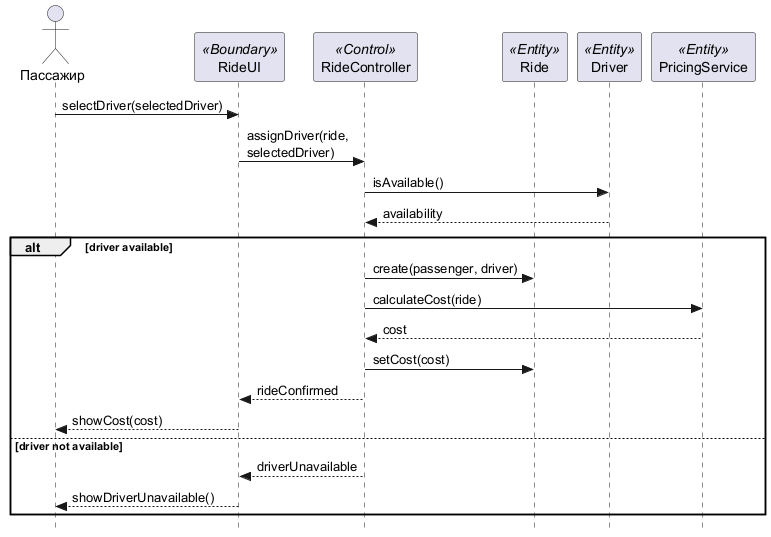
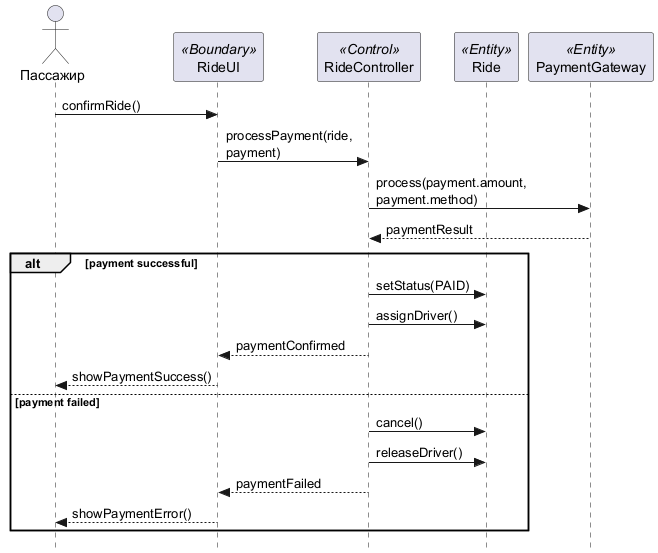
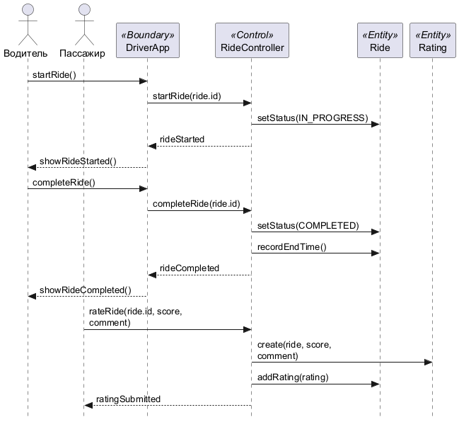
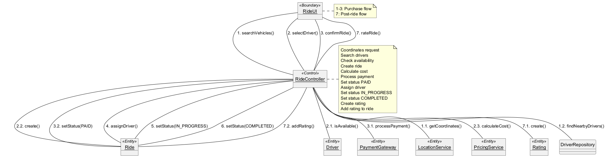

{{json
{
  "discipline": "Программная инженерия",
  "title": "Лабораторная работа № 2. Анализ требований и сценариев таксопарка",
  "student": {"name": "Шкурин Михаил Сергеевич", "course": "3", "group": "ФИТ-242", "program": "02.03.02 Фундаментальная информатика и информационные технологии"},
  "teacher": {"title": "ассистент", "name": "Плескунов Д. А."},
  "institution": {"short": "ОмГТУ", "department": "ПМиФИ", "year": "2026"},
  "work": {"type": "Лабораторная работа"}
}
}}

# АННОТАЦИЯ

Отчёт описывает анализ требований и сценариев системы заказа такси. Восемь воспроизводимых диаграмм охватывают прецеденты, трассировку, классы анализа VOPC, последовательности (4 фазы основного сценария покупки), коммуникацию и ключевые абстракции. Методология основана на главе 3 учебного пособия по UML.

# СОДЕРЖАНИЕ

# ВВЕДЕНИЕ

Цель работы — применить метод анализа требований из главы 3 пособия [1] к системе заказа такси, выбранной для сквозного проекта (вариант 10 — Таксопарк, как в ЛР 1). Задание следует методологии Rational Rose/UML: архитектурный анализ, ключевые абстракции, реализация вариантов использования через VOPC и диаграммы взаимодействия. Нативный проект CASE-средства в репозитории отсутствует; модели представлены редактируемым PlantUML.

# ОСНОВНАЯ ЧАСТЬ

## 1 Предметная область и требования

Пассажир заказывает такси через приложение или диспетчера, водитель выполняет поездку, диспетчер координирует заказы и водителей. Система поддерживает поиск свободных машин, расчёт стоимости, оплату, отмену заказа и оценку поездки.

Таблица: Функциональные и качественные требования

|| ID | Требование | Способ отражения |
||---|---|---|
|| FR-01 | Поиск свободных машин | Прецеденты, фаза 1 |
|| FR-02 | Назначение водителя на заказ | Фаза 2, RideAssignment |
|| FR-03 | Расчёт стоимости поездки по расстоянию/времени | Фаза 2, PriceCalculator |
|| FR-04 | Оплата заказа | Фаза 3, PaymentGateway |
|| FR-05 | Отмена заказа до начала поездки | Прецедент отмены, состояние Ride |
|| FR-06 | Оценка поездки пассажиром | Прецедент оценки, Rating |
|| QR-01 | Защита от двойного назначения водителя на один заказ | Уникальность заказа, атомарное назначение |
|| QR-02 | Отказ оплаты не отменяет назначение водителя | Разделение оплаты и назначения |

## 2 Сценарий Purchase Ride

**Предусловия:** пассажир имеет аккаунт в системе; есть свободные водители. **Основной результат:** оплаченный заказ с назначенным водителем; пассажир видит детали поездки. **Основной поток:** поиск машин; выбор водителя; расчёт стоимости; подтверждение заказа; оплата; назначение водителя; начало поездки; завершение поездки; оценка. **Альтернативы:** нет свободных машин — повторный поиск; отказ оплаты — заказ отменяется; отмена пассажиром до начала — освобождение водителя; сбой оплаты — повторная попытка.

## 3 Соглашения по моделированию

### 3.1 Именование
- Имена вариантов использования — короткие глагольные фразы на русском языке
- Имена классов — существительные на английском языке, начинаются с заглавной буквы
- Имена атрибутов и операций — с маленькой буквы, camelCase
- Составные имена — без подчёркиваний, каждое слово с заглавной (CamelCase)

### 3.2 Организация модели
- Пакет Design Model — содержит все аналитические модели
- Пакет Use-Case Realizations — содержит реализации прецедентов
- Для каждого прецедента создаётся пакет Use-Case Realization – <Name>
- В каждой реализации — кооперация с именем прецедента и стереотипом <<use-case realization>>
- Диаграмма VOPC — внутри каждой кооперации

### 3.3 Стереотипы классов
- <<Boundary>> — граничные классы (UI, API)
- <<Control>> — управляющие классы (контроллеры)
- <<Entity>> — классы-сущности (предметные объекты)

## 4 Ключевые абстракции

Passenger — пассажир, заказывающий поездку
Driver — водитель, выполняющий поездку
Dispatcher — диспетчер, координирующий заказы
Ride — заказ на поездку
Vehicle — автомобиль водителя
Location — местоположение (адрес, координаты)
Payment — платёжная информация
Rating — оценка поездки

## 5 Диаграммы и решения

### 5.1 Диаграмма вариантов использования

**Инженерное обоснование.** Граница системы охватывает заказ и выполнение поездок. Пассажир и водитель имеют общую цель — выполнение поездки, но используют разные каналы (приложение vs водительское приложение). Диспетчер показан отдельным актором для ручного координирования. <<include>> означает обязательные шаги (поиск, расчёт, оплата), <<extend>> — условные действия (отмена, оценка). Обобщение акторов исключает дублирование сценария покупки.

### 5.2 Трассировка прецедентов

**Инженерное обоснование.** Каждый существенный прецедент связан с реализацией и конкретными классами проектной модели. Эта связь нужна для проверки покрытия: изменение шага Purchase Ride требует пересмотра RideController и Ride, а изменение диспетчерского управления — DispatcherController. Трассировка не заменяет исполняемые тесты, но показывает, какие артефакты должны меняться совместно.

### 5.3 Классы анализа VOPC

**Инженерное обоснование.** Граничный RideUI принимает действия пользователя, RideController координирует сценарий, а Ride, Vehicle, Location, Payment и Rating хранят предметные состояния. Граничные классы изолируют платёжный шлюз и геолокацию. Такое разделение предотвращает размещение правил доступности водителя в интерфейсе или внешнем сервисе.

### 5.4 Последовательность: поиск машин

**Инженерное обоснование.** Первая фаза запрашивает доступные машины в радиусе пользователя. Чтение доступности возвращает состояние на момент запроса, поэтому отображение свободного водителя не гарантирует будущую поездку. Окончательное решение переносится в атомарный шаг назначения.

### 5.5 Последовательность: назначение водителя

**Инженерное обоснование.** Во второй фазе контроллер пытается назначить выбранного водителя и создаёт заказ. Одна операция должна проверить отсутствие активного назначения или выполнения и зафиксировать назначение с TTL; при конфликте система возвращает занятость без частичного заказа. В распределённой реализации это требует транзакции или атомарной команды хранилища.

### 5.6 Последовательность: оплата

**Инженерное обоснование.** Оплата вынесена во внешний шлюз. Ответ подтверждается по ключу идемпотентности, после чего заказ переходит в оплаченный; отказ и истечение назначения освобождают водителя. Повторный callback не должен создавать второй заказ. В модели явно разделены событие оплаты и внутренняя фиксация заказа.

### 5.7 Последовательность: выполнение поездки

**Инженерное обоснование.** Выполнение поездки происходит после подтверждения оплаты и назначения. Сбой отслеживания не отменяет оплаченную поездку: система полагается на подтверждение от водителя. После завершения пассажир может оценить поездку. Отмена до начала освобождает водителя без штрафов.

### 5.8 Диаграмма коммуникации

**Инженерное обоснование.** Нумерованные сообщения показывают тот же основной сценарий покупки, что и четыре диаграммы последовательности. Разница представления полезна для контроля связности объектов: RideUI не обращается напрямую к базе или шлюзу, а все изменения заказа идут через контроллер.

# ЗАКЛЮЧЕНИЕ

Получена связанная модель из восьми диаграмм: прецеденты трассируются к классам анализа, четыре фазы последовательности и коммуникационная диаграмма описывают одну покупку. Для практической реализации необходимы транзакционное назначение водителя, идемпотентность платежей и очередь повторной доставки.

# СПИСОК ИСПОЛЬЗОВАННЫХ ИСТОЧНИКОВ

1. Учебное пособие по UML, `materials/UML (2).pdf`, глава 3 (стр. 53–105).
2. Образец ЛР 2, `materials/lab_2/REPORT_LAB_2.md`.
3. Исходники моделей ЛР 2, `materials/lab_2/diagrams/*.puml`.
