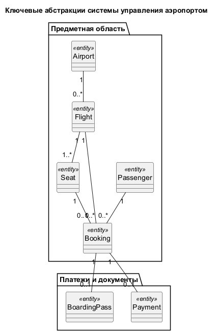
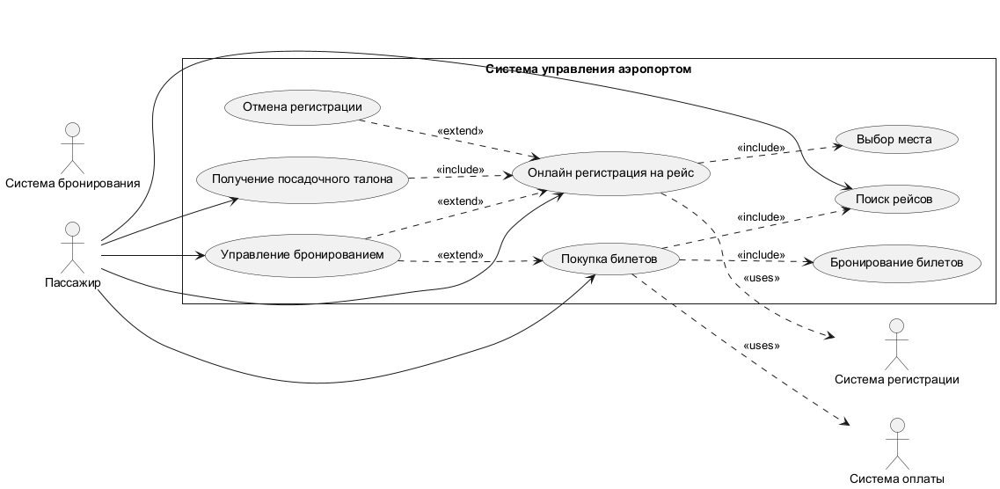
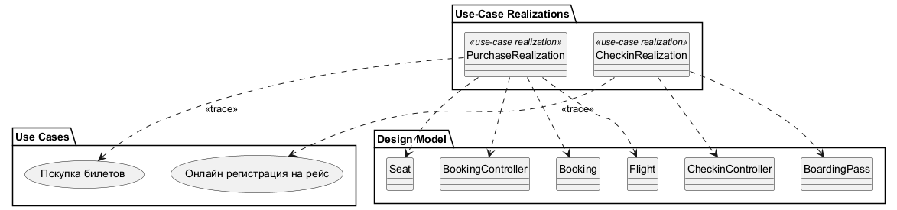
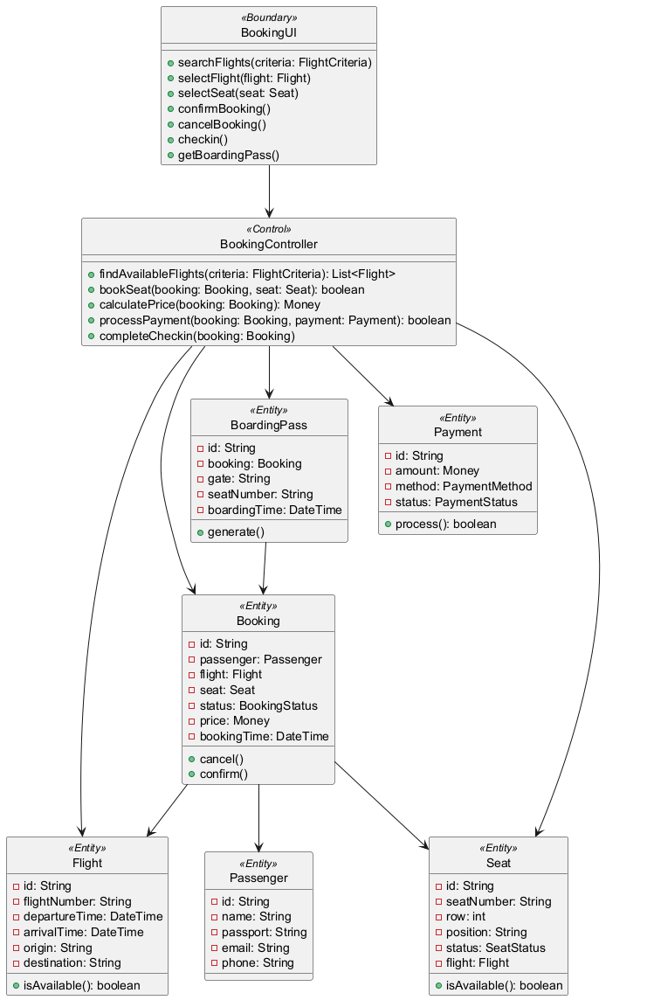
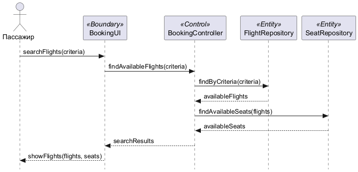
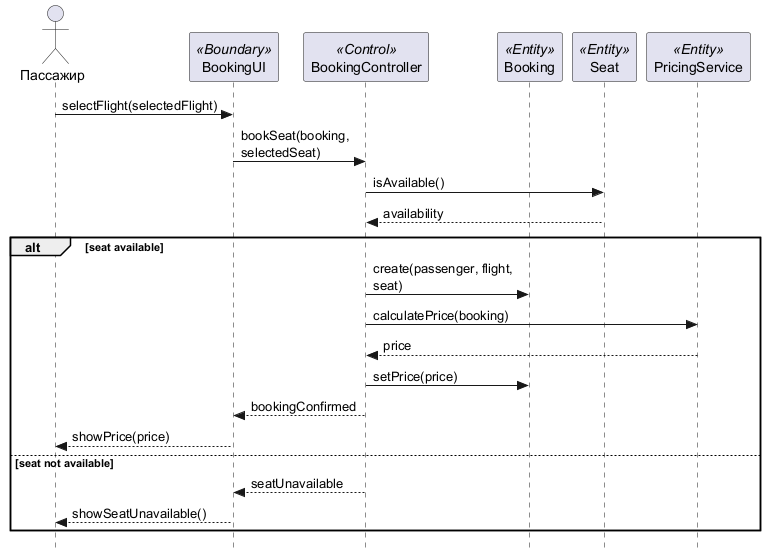
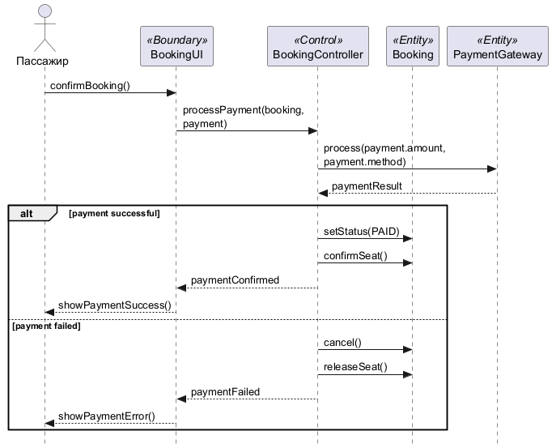
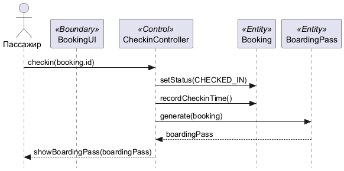
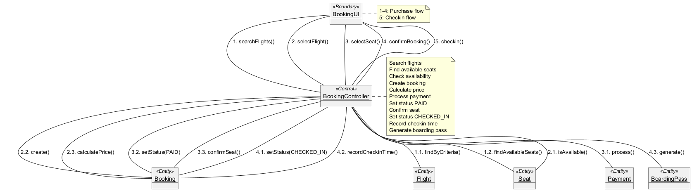

{{json
{
  "discipline": "Программная инженерия",
  "title": "Лабораторная работа № 2. Анализ требований и сценариев аэропорта",
  "student": {"name": "Шкурин Михаил Сергеевич", "course": "3", "group": "ФИТ-242", "program": "02.03.02 Фундаментальная информатика и информационные технологии"},
  "teacher": {"title": "ассистент", "name": "Плескунов Д. А."},
  "institution": {"short": "ОмГТУ", "department": "ПМиФИ", "year": "2026"},
  "work": {"type": "Лабораторная работа"}
}
}}

# АННОТАЦИЯ

Отчёт описывает анализ требований и сценариев системы управления аэропортом. Девять воспроизводимых диаграмм охватывают прецеденты, трассировку, классы анализа VOPC, последовательности (4 фазы основного сценария покупки билетов), кооперацию и ключевые абстракции. Методология основана на главе 3 учебного пособия по UML.

# СОДЕРЖАНИЕ

# ВВЕДЕНИЕ

Цель работы — применить метод анализа требований из главы 3 пособия [1] к системе управления аэропортом, выбранной для варианта 5 (Аэропорт). Задание следует методологии Rational Rose/UML: архитектурный анализ, ключевые абстракции, реализация вариантов использования через VOPC и диаграммы взаимодействия. Нативный проект CASE-средства в репозитории отсутствует; модели представлены редактируемым PlantUML.

# ОСНОВНАЯ ЧАСТЬ

## 1 Предметная область и требования

Пассажир ищет рейсы, покупает билеты, бронирует места, проходит онлайн регистрацию и получает посадочный талон. Система бронирования управляет доступностью мест, система оплаты обрабатывает транзакции, система регистрации назначает посадочные места.

Таблица: Функциональные и качественные требования

|| ID | Требование | Способ отражения |
||---|---|---|
|| FR-01 | Поиск рейсов по критериям (дата, маршрут, цена) | Прецеденты, фаза 1 |
|| FR-02 | Бронирование билетов с выбором места | Фаза 2, BookingController |
|| FR-03 | Оплата билетов через платёжный шлюз | Фаза 3, PaymentGateway |
|| FR-04 | Онлайн регистрация на рейс | Фаза 4, CheckinController |
|| FR-05 | Управление бронированием (изменение, отмена) | Прецедент изменения, Booking |
|| FR-06 | Получение посадочного талона | Прецедент регистрации, BoardingPass |
|| QR-01 | Защита от двойного бронирования одного места | Уникальность места, атомарное бронирование |
|| QR-02 | Отмена оплаты не отменяет бронирование | Разделение оплаты и бронирования |

## 2 Сценарий Purchase Tickets

**Предусловия:** пассажир имеет аккаунт в системе; есть доступные рейсы и места. **Основной результат:** оплаченный билет с выбранным местом; пассажир видит детали рейса. **Основной поток:** поиск рейсов; выбор рейса и места; бронирование; оплата; подтверждение; получение электронного билета. **Альтернативы:** нет доступных рейсов — повторный поиск; отказ оплаты — бронирование отменяется через TTL; отмена пассажиром до оплаты — освобождение места; сбой оплаты — повторная попытка.

## 3 Соглашения по моделированию

### 3.1 Именование
- Имена вариантов использования — короткие глагольные фразы на русском языке
- Имена классов — существительные на английском языке, начинаются с заглавной буквы
- Имена атрибутов и операций — с маленькой буквы, camelCase
- Составные имена — без подчёркиваний, каждое слово с заглавной (CamelCase)

### 3.2 Организация модели
- Пакет Design Model — содержит все аналитические модели
- Пакет Use-Case Realizations — содержит реализации прецедентов
- Для каждого прецедента создаётся пакет Use-Case Realization – <Name>
- В каждой реализации — кооперация с именем прецедента и стереотипом <<use-case realization>>
- Диаграмма VOPC — внутри каждой кооперации

### 3.3 Стереотипы классов
- <<Boundary>> — граничные классы (UI, API)
- <<Control>> — управляющие классы (контроллеры)
- <<Entity>> — классы-сущности (предметные объекты)

## 4 Ключевые абстракции

Passenger — пассажир, покупающий билеты
Flight — рейс, на который покупается билет
Seat — место в самолёте
Booking — бронирование билета
Payment — платёжная информация
BoardingPass — посадочный талон
Airport — аэропорт (взлётно-посадочная полоса, терминал)

## 5 Диаграммы и решения

### 5.1 Диаграмма вариантов использования

**Инженерное обоснование.** Граница системы охватывает покупку билетов и онлайн регистрацию. Пассажир — основной пользователь внешних систем (платёжный шлюз, система бронирования, система регистрации) показаны отдельными актёрами для интерфейсов. <<include>> означает обязательные шаги (поиск, бронирование, выбор места, получение талона), <<extend>> — условные действия (управление бронированием, отмена регистрации). Обобщение актёров исключает дублирование сценария покупки.

### 5.2 Трассировка прецедентов

**Инженерное обоснование.** Каждый существенный прецедент связан с реализацией и конкретными классами проектной модели. Эта связь нужна для проверки покрытия: изменение шага Purchase Tickets требует пересмотра BookingController и Booking, а изменение логики регистрации — CheckinController. Трассировка не заменяет исполняемые тесты, но показывает, какие артефакты должны меняться совместно.

### 5.3 Классы анализа VOPC

**Инженерное обоснование.** Граничный BookingUI принимает действия пользователя, BookingController координирует сценарий, а Booking, Flight, Seat, Payment и BoardingPass хранят предметные состояния. Граничные классы изолируют платёжный шлюз и систему бронирования. Такое разделение предотвращает размещение правил доступности места в интерфейсе или внешнем сервисе.

### 5.4 Последовательность: поиск рейсов

**Инженерное обоснование.** Первая фаза запрашивает доступные рейсы по критериям пользователя. Чтение доступности возвращает состояние на момент запроса, поэтому отображение свободного места не гарантирует будущую покупку. Окончательное решение переносится в атомарный шаг бронирования.

### 5.5 Последовательность: бронирование

**Инженерное обоснование.** Во второй фазе контроллер пытается забронировать выбранное место и создаёт бронирование. Одна операция должна проверить отсутствие активного бронирования и зафиксировать бронирование с TTL; при конфликте система возвращает занятость без частичного бронирования. В распределённой реализации это требует транзакции или атомарной команды хранилища.

### 5.6 Последовательность: оплата

**Инженерное обоснование.** Оплата вынесена во внешний шлюз. Ответ подтверждается по ключу идемпотентности, после чего бронирование переходит в оплаченное; отказ и истечение бронирования освобождают место. Повторный callback не должен создавать второе бронирование. В модели явно разделены событие оплаты и внутренняя фиксация бронирования.

### 5.7 Последовательность: регистрация

**Инженерное обоснование.** Регистрация происходит после подтверждения оплаты и бронирования. Сбой генерации талона не отменяет оплаченный билет: система полагается на подтверждение от системы регистрации. После завершения пассажир получает посадочный талон. Отмена до начала освобождает место без штрафов.

### 5.8 Диаграмма кооперации

**Инженерное обоснование.** Нумерованные сообщения показывают тот же основной сценарий покупки, что и четыре диаграммы последовательности. Разница представления полезна для контроля связности объектов: BookingUI не обращается напрямую к базе или шлюзу, а все изменения бронирования идут через контроллер. Объекты в диаграмме соответствуют классам из VOPC (BookingUI, BookingController, Booking, Flight, Seat, Payment, BoardingPass).

### 5.9 Ключевые абстракции

**Инженерное обоснование.** Ключевые абстракции выделены по предметной области аэропорта: пассажир, рейс, место, бронирование, платёж, посадочный талон, аэропорт. Связи показывают основную модель данных: один рейс имеет много мест, одно место может быть забронировано, одно бронирование связано с одним рейсом и одним местом, одно бронирование имеет один платёж и один посадочный талон. Это базовая модель для реализации: таблицы базы данных или классы-сущности.

# ЗАКЛЮЧЕНИЕ

Получена связанная модель из девяти диаграмм: прецеденты трассируются к классам анализа, четыре фазы последовательности и диаграмма кооперации описывают одну покупку билета. Для практической реализации необходимы транзакционное бронирование места, идемпотентность платежей и очередь повторной доставки.

# СПИСОК ИСПОЛЬЗОВАННЫХ ИСТОЧНИКОВ

1. Учебное пособие по UML, `materials/UML (2).pdf`, глава 3 (стр. 53–105).
2. Образец ЛР 2, `materials/lab_2/REPORT_LAB_2.md`.
3. Исходники моделей ЛР 2, `materials/lab_2/diagrams/*.puml`.
